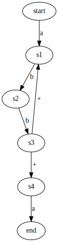
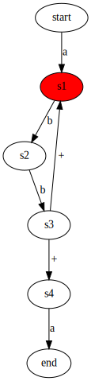
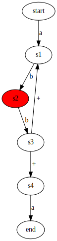
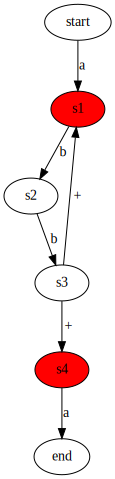
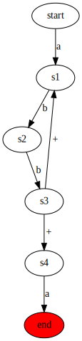

# re2py

Implementation of Ruxx Cox's https://swtch.com/~rsc/regexp/regexp1.html in python

## How to use

See `tests/` and `examples/`.

## Visualize in SVG format

### NFA

REGEX  = `a(bb)+a`

### Match process

REGEX  = `a(bb)+a`
STRING = `abbbba`

     
